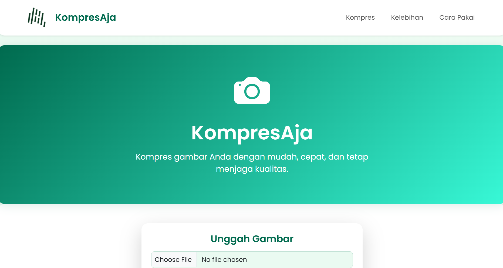
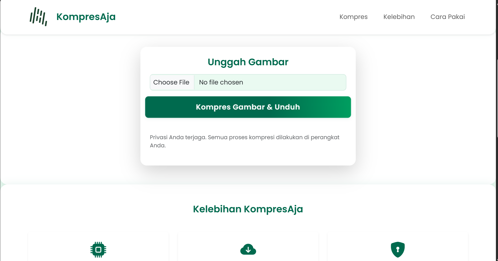
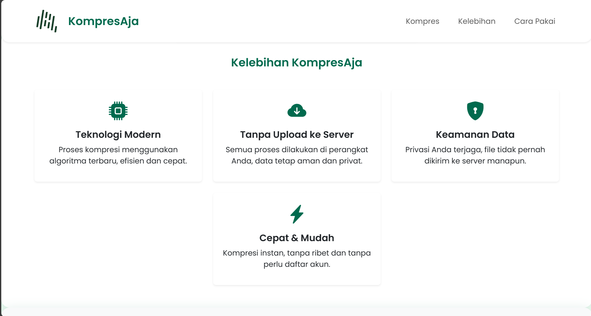
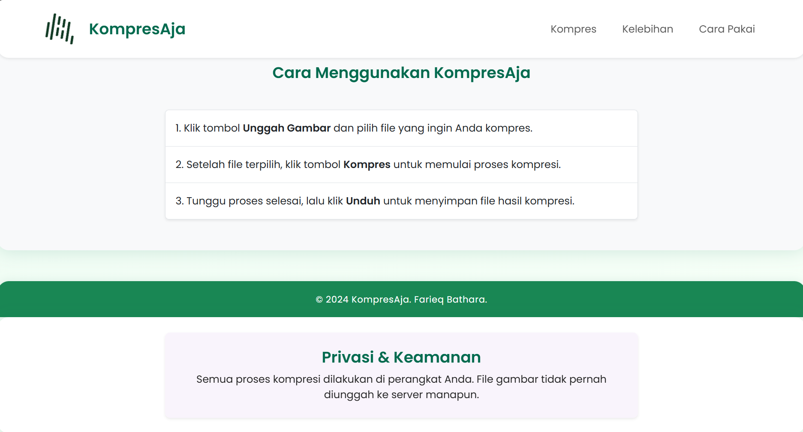
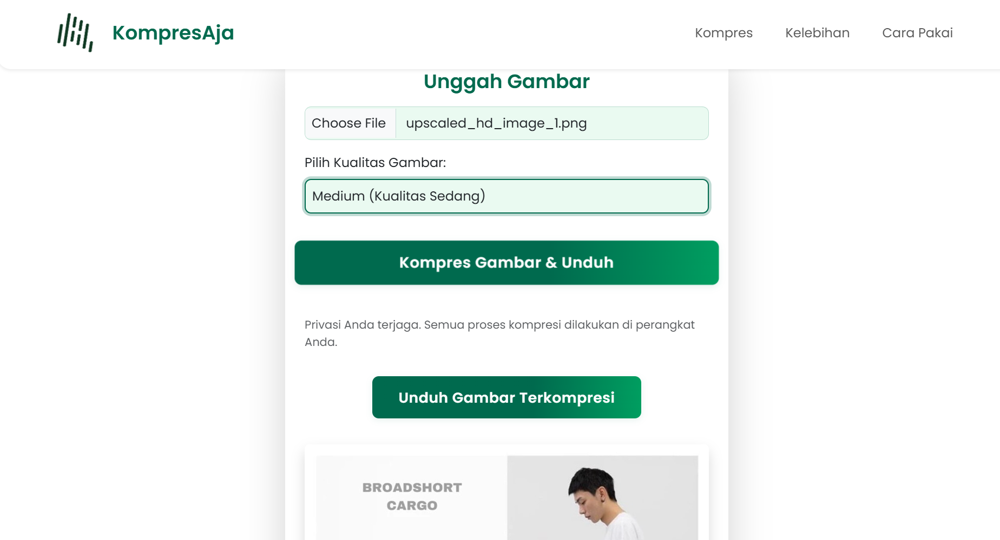

# KompresAja

## Desain Aplikasi

KompresAja adalah aplikasi web untuk kompresi gambar secara cepat, mudah, dan aman di perangkat pengguna.

### Fitur Utama

- Kompresi gambar (JPEG, PNG, dsb) langsung di browser (client-side).
- Pilihan kualitas kompresi: High, Medium, Low.
- Tidak ada upload ke server, privasi terjaga.
- Tampilan modern, responsif, dan mudah digunakan.

### Desain UI

- **Hero Section:** Gradien hijau botol, icon kamera, judul aplikasi, deskripsi singkat.
- **Form Kompresi:** Input file gambar, dropdown kualitas, tombol kompres, hasil unduhan.
- **Fitur/Kelebihan:** Card dengan icon teknologi.
- **Footer:** Hak cipta.

#### Contoh Tampilan:







## Metode Kompresi

- Kompresi gambar menggunakan elemen `<canvas>` di JavaScript.
- Gambar di-load ke canvas, di-resize (jika perlu), dan dikonversi ke JPEG dengan kualitas sesuai pilihan user.
- Hasil kompresi diunduh langsung oleh user.
- Semua proses di browser, tidak ada data yang dikirim ke server.

## Aplikasi

- **Teknologi:** HTML5, CSS3 (Bootstrap 5), JavaScript, Bootstrap Icons.
- **Struktur file:**
  ```
  / (root)
    ├── index.html
    ├── style.css
    ├── script.js
    ├── 1.png
    └── logo.png (opsional)
  ```

## Manual Book

### Cara Menggunakan

1. Buka website KompresAja di browser.
2. Klik "Unggah Gambar" dan pilih file gambar.
3. Pilih kualitas kompresi.
4. Klik "Kompres Gambar & Unduh".
5. Unduh hasil gambar terkompresi.

### Tips

- Gunakan gambar berukuran besar agar efek kompresi terasa.
- Pilih "High" untuk kualitas bagus, "Low" untuk ukuran file kecil.

### FAQ

- **Aman?** Ya, semua proses di perangkat Anda.
- **Bisa untuk PDF?** Tidak, hanya gambar.

---
